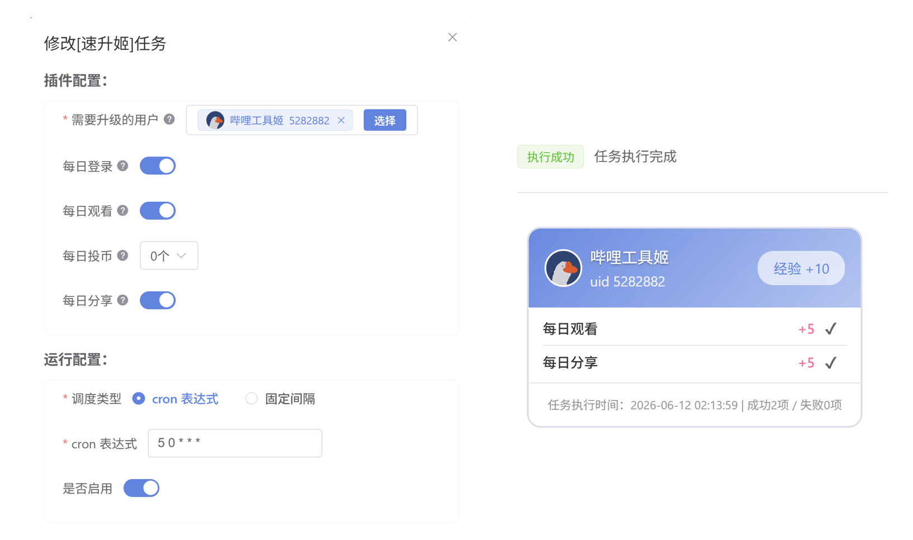

# 速升姬

## 项目简介

[哔哩工具姬](https://github.com/hzhilong/bilitoolkit) 插件。

用于自动完成每日经验任务，包括每日登录、观看、投币和分享。

## 截图

## 安装使用

1. 安装并启动 [哔哩工具姬](https://github.com/hzhilong/bilitoolkit)；
2. 在插件市场中搜索并安装「速升姬」；
3. 打开「速升姬」新建任务，根据提示完成任务配置；
4. 新建任务后，插件将按设定时间自动执行任务。

## 注意事项

* 使用本插件产生的任何后果由使用者自行承担；
* 本项目仅供学习、研究和技术交流使用，请勿将其用于违反相关平台规则的用途；
* 本项目与哔哩哔哩官方无任何关联。